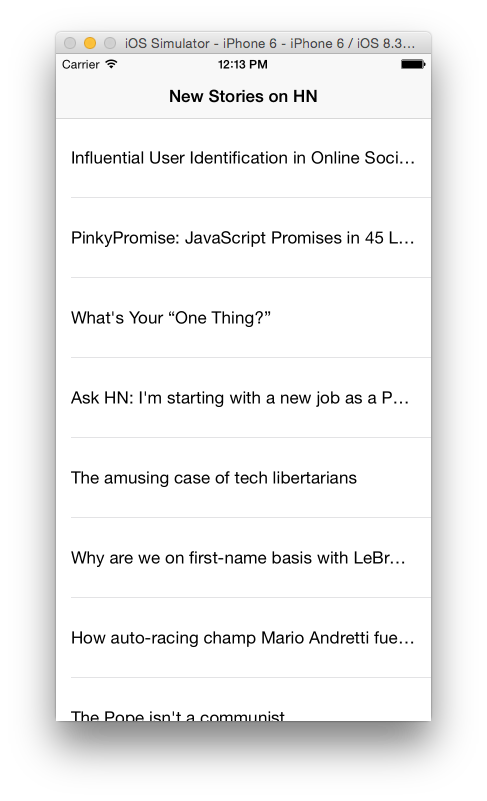

[](https://github.com/Carthage/Carthage)

### GCDTimer ###
Well tested Grand Central Dispatch (GCD) Timer in Swift. Checkout the [test](GCDTimerTests/GCDTimerTests.swift) file.

### Usage ###

#### Long running timer ####
```swift
import GCDTimer

class Demo {

  init() {
    let timer = GCDTimer(intervalInSecs: 20)
    
    timer.Event = {
      println("Hello World")
      
      // Send some data to the server
    }
    
    timer.start()
    
    //Don't forget to pause the timer in the AppDelegate:applicationWillResignActive(application: UIApplication) method.
  }

}

```

#### Autofinishing timer ####

```swift
import GCDTimer

class Demo {

  init() {
    let timer = GCDTimer(intervalInSecs: 2)
    
    timer.Event = {
      timer.pause()
      //Process after finishing the timer
    }
    
    timer.start()
  }
  
}
```

#### Dispatch After - Delay ####

```swift
var index = 0
GCDTimer.delay(2) {
    index += 1
}
```

### Installation ###

* Add ```github "hemantasapkota/GCDTimer"``` to your ```cartfile```
* Execute ```carthage update```

### Example ###
The example shows how to use GCDTimer to periodically poll newly submitted items from Hacker News.



### Author ###
* [Hemanta Sapkota](https://twitter.com/ozhemanta) / [Blog](http://hemantasapkota.github.io/) / [Linked In](https://au.linkedin.com/in/hemantasapkota)

### License ###
The MIT License (MIT)

Copyright (c) 2017 Hemanta Sapkota

Permission is hereby granted, free of charge, to any person obtaining a copy
of this software and associated documentation files (the "Software"), to deal
in the Software without restriction, including without limitation the rights
to use, copy, modify, merge, publish, distribute, sublicense, and/or sell
copies of the Software, and to permit persons to whom the Software is
furnished to do so, subject to the following conditions:

The above copyright notice and this permission notice shall be included in all
copies or substantial portions of the Software.

THE SOFTWARE IS PROVIDED "AS IS", WITHOUT WARRANTY OF ANY KIND, EXPRESS OR
IMPLIED, INCLUDING BUT NOT LIMITED TO THE WARRANTIES OF MERCHANTABILITY,
FITNESS FOR A PARTICULAR PURPOSE AND NONINFRINGEMENT. IN NO EVENT SHALL THE
AUTHORS OR COPYRIGHT HOLDERS BE LIABLE FOR ANY CLAIM, DAMAGES OR OTHER
LIABILITY, WHETHER IN AN ACTION OF CONTRACT, TORT OR OTHERWISE, ARISING FROM,
OUT OF OR IN CONNECTION WITH THE SOFTWARE OR THE USE OR OTHER DEALINGS IN THE
SOFTWARE.

